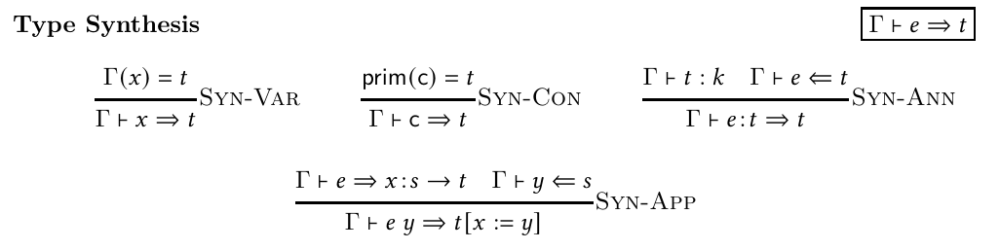
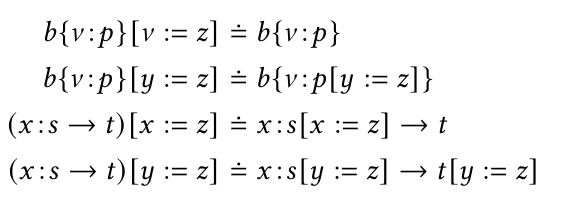
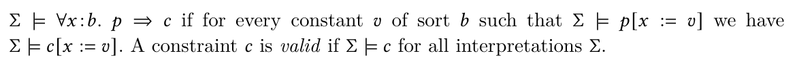
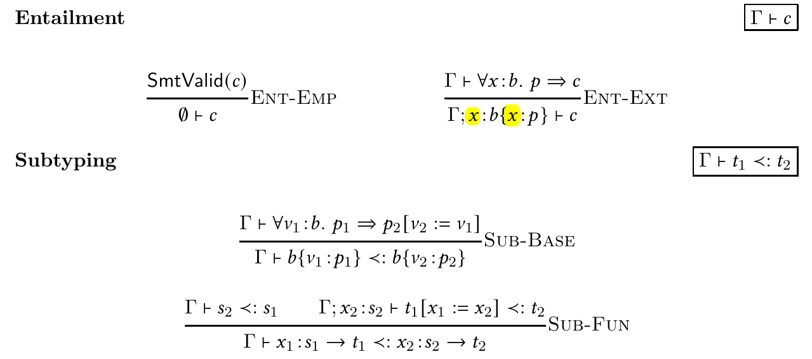
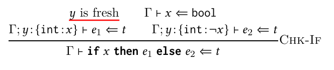

[]: <> (Set fonts for main body of document)

\setmainfont{DejaVu Serif}
\setsansfont{DejaVu Sans}
\setmonofont{DejaVu Sans Mono}
\setmathfont{Latin Modern Math}

[]: <> (Set Agda code fonts)
[]: <> (https://agda.readthedocs.io/en/v2.6.2.2/tools/generating-latex.html)
\newfontfamily{\AgdaRegularFont}{Source Code Pro}
\newfontfamily{\AgdaMediumFont}{Source Code Pro Medium}
\newfontfamily{\AgdaLightFont}{Source Code Pro Light}
\renewcommand{\AgdaFontStyle}[1]{{\AgdaMediumFont{}#1}}
\renewcommand{\AgdaKeywordFontStyle}[1]{{\AgdaMediumFont{}#1}}
\renewcommand{\AgdaStringFontStyle}[1]{{\AgdaLightFont{}#1}}
\renewcommand{\AgdaCommentFontStyle}[1]{{\AgdaLightFont{}#1}}
\renewcommand{\AgdaBoundFontStyle}[1]{\AgdaRegularFont{}#1}


:::: hidden ::::
```agda
module report where
open import Util.All
```
::::::::::::::::


# Introduction

*Refinement type systems* allow programmers to write rich specifications for their programs by *refining* type signatures with logical predicates. For example, the annotation on `r_sq`'s return type asserts that `r_sq` produces only non-negative values.

~~~haskell
-- Compute modulus-squared of a vector
r_sq : Real × Real → Real[v | v >= 0]
r_sq (x , y) = x * x + y * y
~~~

These refinement types are automatically checked at compile-time, and can be used in proving more complicated properties, e.g. that the call to `sqrt` is safe:

~~~haskell
primitive sqrt : Real[v | v >= 0] → Real

-- Euclidean distance between two vectors
vec_dist : Real × Real → Real × Real → Real
vec_dist (x1 , y1) (x2 , y2) =
    sqrt $ r_sq ((x1 - x2) , (y1 - y2))
~~~

More information on programming with refinement types can be found at the liquidhaskell website [@lh-website], we now turn to how these type systems are *implemented*.

Jhala and Vazou [@refinement-tut] give a tutorial-style presentation of the theory behind refinement type systems, starting with a minimal STLC-like language and showing how to add features one by one.

Unfortunately, these type systems are described only semi-formally, using a combination of \LaTeX{} rules, pseudocode functions, and prose (e.g. [@fig:rules-syn; @fig:subst-defn; @fig:prose-defn]), which leave room for ambiguity and mistakes.

It's also not clear whether real (i.e. executable) implementations of the type systems (e.g. Sprite [@sprite]) correctly implement the rules in the paper.

# What have I built?

I have formalized the languages in [@refinement-tut] up to Lang-λβ, i.e. a simply-typed λ-calculus with refinement types, branches, and recursion. My Agda formalization includes:

An implementation of Lang-λβ's *typing rules*

: e.g. the paper's type-synthesis relation in [@fig:rules-syn] is formalized as the data type in [@lst:ex-rules-syn]

A proof-producing *type-checker*

: for Lang-λβ programs (@sec:a-proof-producing-type-checker)

Fixes for various *bugs* in the paper

: ([@sec:bugs-found])

Source code for this formalization (and report) can be found at <https://github.com/lawcho/simple-refinement-types-agda>


{#fig:rules-syn}

{#fig:subst-defn}

{#fig:prose-defn}

:::: hidden ::::
```agda
module Example-Synth where
  open import Lang-λ.Refinement
  open import Lang-λ.Type
  open import Lang-λ.Term
  open import Lang-λ.Typing
  open import Common.Example-Solver
  open With-SMT solver hiding (_⊢_⇒ᵗ_)

```
::::::::::::::::

```agda
  data _⊢_⇒ᵗ_ (Γ : Context)
    : Term → Type → Set
    where
      syn-var
          : ∀ {x t ptr}
          → lookup x Γ ≡ yes (t , ptr)
          ---------------------------
          → Γ ⊢ var x ⇒ᵗ t
      syn-con
          : ∀{c t}
          → prim c ≡ t
          ---------------
          → Γ ⊢ con c ⇒ᵗ t
      syn-ann
          : ∀{e t k}
          → Γ ⊢ t :ᵏ k
          → Γ ⊢ e ⇐ᵗ t
          ---------------
          → Γ ⊢ e ⦂ t ⇒ᵗ t
      syn-app
          : ∀ {e x s t y}
          → Γ ⊢ e ⇒ᵗ (x ⦂ s →' t)
          → Γ ⊢ var y ⇐ᵗ s
          -------------------------------
          → Γ ⊢ e [ y ] ⇒ᵗ (t [ x := y ]ₜ)
```

: Formalization of the `Γ ⊢ e ⇒ t` relation from [@fig:rules-syn] {#lst:ex-rules-syn}

# What worked well

Bug-fixes aside, my formalization follows the paper closely, and is quite concise. This is thanks to the following design decisions:

## A Proof-Producing Type-Checker

My type-checker always gives the correct answer, and can prove it!

We can know this from its type signature:

:::: hidden ::::
```agda
module Checker-Sig where
  open import Lang-λβ.Typing
  open import Common.Example-Solver
  open With-SMT solver
  open import Lang-λβ.Term
  open import Lang-λβ.Sugar
  postulate
```
::::::::::::::::

```agda
    check :
      (Γ : Context) →
      (e : Term) →
      (t : Type) →
      Dec (Γ ⊢ e ⇐ᵗ t)
```

which says that `check` is a function that takes a context
`Γ`, a term `e`, and a type `t`, then
`Dec`ides `Γ ⊢ e ⇐ᵗ t`, i.e. produces either a typing
derivation for `Γ ⊢ e ⇐ᵗ t`, or a proof that no such typing
derivation exists.

:::: hidden ::::
```agda
module example1 where

  open import Lang-λβ.Typing
  open import Common.Example-Solver
  open With-SMT solver
  open import Lang-λβ.Algorithmic-Typing solver
  open import Lang-λβ.Refinement
  open import Lang-λβ.Sugar

  open import Common.VC-Syntax.Type
  open import Common.VC-Syntax.Predicate
  open import Common.VC-Syntax.Constraint
```
::::::::::::::::

Let's see it in action! Here's a Lang-λβ program which is supposed to always return a non-negative number:

```agda
  abs-diff =
    λλ"x"∙ λλ"y"∙
    letₑ "x≤y" := "x" ≤ₑ "y" inₑ
    ifₑ   "x≤y"
    thenₑ "y" -ₑ "x"
    elseₑ "x" -ₑ "y"
```

To prove that `abs-diff` has this property, we can encode the property as a type `ty`:

```agda
  ty =
    "x"⦂ int ⟨⟩ →'
    "y"⦂ int ⟨⟩ →'
    int ⟨"z"∣ -1 <ᵣ "z" ⟩
```

then construct a typing derivation proving that `abs-diff` has that type:

```agda
  typing-der : [] ⊢ abs-diff ⇐ᵗ ty
```

by calling `check`, and extracting its (positive) result:

```agda
  typing-der with
    ofʸ der ← proof $ check [] abs-diff ty
    = der
```

## Mocking SMT

To decide typing relations like those above, the type-`check`er depends on an external tool. Let's see how.

Following the typing rules, the type-checker breaks down the judgement `[] ⊢ abs-diff ⇐ᵗ ty` to subtyping constraints including `_c`:

```agda
  _c =
      (raw (var "x≤y" ▹ == ◃ true)
    ∷ ("x≤y"⦂ bool ⟨"b"∣ var "b"
        ▹ == ◃ ((var "x" ▹ < ◃ var "y")
        ▹ ∨ ◃   (var "x" ▹ == ◃ var "y"))⟩)
    ∷ ("y"⦂ int ⟨⟩) ∷ ("x"⦂ int ⟨⟩) ∷ [])
    ⊢  int ⟨"v"∣ var "v"
        ▹ == ◃ (var "y" ▹ - ◃ var "x")⟩
    ≺: int ⟨"z"∣ -1 ▹ < ◃ var "z"⟩
```

which it passes if and only if a corresponding logical formula `_vc` is valid:

```agda
  _vc =
    ∀∀ int ∙ ∀∀ int ∙ ∀∀ bool ∙
      (var ↑0 ▹ == ◃
      (     (var ↑2 ▹ < ◃  var ↑1)
      ▹ ∨ ◃ (var ↑2 ▹ == ◃ var ↑1))) ⇒
        (var ↑0 ▹ == ◃ true) ⇒
          ∀∀ int ∙
            (var ↑0 ▹ == ◃
            (var ↑2 ▹ - ◃ var ↑3)) ⇒
              pred (-1 ▹ < ◃ var ↑0)

```

Notice how `_vc` is quite complex: it contains many different logical connectives, and even statements about integer arithmetic.

To efficiently decide formulas like `_vc`, the checker queries an external tool -- an *SMT solver*.
Unfortunately, existing SMT solvers are extremely complex^[
Microsoft's [Z3]{.smallcaps} [@z3github] weighs in at over 400k lines of C++:  
`curl -L https://api.codetabs.com/v1/loc?github=Z3Prover/z3`],
making formalizing them a challenge.

I avoided this problem by instead *mocking* an SMT solver -- i.e. I implemented just enough of an SMT solver to cover all the queries that the example programs make.

The mock is too verbose to present here, but can be found in `Common.Example-Solver.agda`^[e.g. the query `_vc` is covered on lines 362-386].

## Mocking SMT *Soundly* 

The SMT solver mock might not be complete, but at least it never gives wrong answers to queries (i.e. it is "sound").

We can be sure that the mock is sound because (like `check`) it does not return a `Bool`, but rather a `Dec`ision (this time for VC validity):

:::: hidden ::::
```agda
module Type-Of-solver where
  open import Common.VC-Syntax.Constraint
  open import Common.VC-Semantics.Constraint
  postulate
```
::::::::::::::::

```agda
    smt-mock : (vc : VC) → Dec (Valid vc)
```

## Mixed-Style VC Semantics

:::: hidden ::::
```agda
module Predicate-Denot-Sem {Γ} Δ where
  open import Common.VC-Syntax.Type
  open import Common.VC-Syntax.Predicate
  open import Common.VC-Semantics.Type
```
::::::::::::::::

For the SMT mock to produce VC validity (dis-)proofs, I first needed to define the type, `Valid`, of VC-validity proofs (aka the "semantics" of VCs).

This semantics is a bit unusual, since it mixes two different styles: VC constraints get a denotational semantics (i.e. a translation *function*), whereas VC predicates get a big-step semantics (i.e. a translation *relation*).

This is deliberate: the obvious denotational semantics for predicates is easy to give (@lst:vc-pred-denot-sem), but very awkward to write decision procedures for.

```agda
  _ₚ : ∀ {τ} → Predicate Γ τ →  τ ₜ
   true ₚ   = 𝔹.true
   false ₚ  = 𝔹.false
   ¬ p ₚ    = 𝔹.not  p ₚ
   p₁ ▹ < ◃ p₂ ₚ = does ( p₁ ₚ ℤ.<?  p₂ ₚ)
   p₁ ▹ > ◃ p₂ ₚ = does ( p₂ ₚ ℤ.<?  p₁ ₚ)
   p₁ ▹ ∧ ◃ p₂ ₚ =  p₁ ₚ 𝔹.∧  p₂ ₚ
   p₁ ▹ ∨ ◃ p₂ ₚ =  p₁ ₚ 𝔹.∨  p₂ ₚ
   p₁ ▹ + ◃ p₂ ₚ =  p₁ ₚ ℤ.+  p₂ ₚ
   p₁ ▹ - ◃ p₂ ₚ =  p₁ ₚ ℤ.-  p₂ ₚ
   p₁ ▹ == {ty} ◃ p₂ ₚ with ty
  ... | int  = does ( p₁ ₚ ℤ.≟   p₂ ₚ)
  ... | bool = does ( p₁ ₚ 𝔹.≟   p₂ ₚ)
   num x ₚ      = x
   var ptr ₚ    = follow ptr into Δ
   if p₁ then p₂ else p₃ ₚ with  p₁ ₚ
  ... | 𝔹.true  =  p₂ ₚ
  ... | 𝔹.false =  p₃ ₚ
```

: Denotational semantics for VC predicates {#lst:vc-pred-denot-sem}

The problem is that `_ₚ` produces expressions containing function calls, which block unification when placed in types, making predicate-value proofs difficult to split up^[e.g. `pf : 𝔹.true ≡ does (x ℤ.≟ y) 𝔹.∧ does (y ℤ.≟ num 4)` can't be matched (as `refl`) since Agda can't unify the LHS and RHS of the equation] or combine.

In contrast, big-step derivations can be split up by pattern-matching constructors. The constructors also make combining derivations easy.
This helps keep VC-validity proofs short & structured.


## Capture-avoiding α-renaming

The typing rules use *capture-avoiding substitution*, a notoriously fickle algorithm (see [@sec:bugs-found]).

Fortunately, we don't actually need the full *substitution* algorithm -- the special case of *α-renaming* is sufficient (and easier to implement). This is possible since Lang-λβ is an *Administrative Normal Form* language^[i.e. a language where functions can only be applied to variables].

This formalization implements (capture-avoiding) α-renaming using a brand new, stateless algorithm. Let's derive it now.

### The new algorithm

:::: hidden ::::
```agda
module α-renaming-algorithm
    (String : Set)
    (_==_ : String → String → 𝔹)
  where
  infixr 25 λλ_∙_
  infixl 24 _[_↦_] _[_↔_] 

  infixr 10 _if_∣_
  infix 11 _otherwise
  _otherwise : ∀{ℓa}{A : Set ℓa} → A → A
  _otherwise = id
  _if_∣_ : ∀{ℓa}{A : Set ℓa} → A → 𝔹 → A → A
  a if 𝔹.true ∣ _ = a
  _ if 𝔹.false ∣ a = a

  _[_↔_]' : String → String → String → String
```
::::::::::::::::

For simplicity, we'll work with the untyped lambda calculus, which has only two constructors:

```agda
  data Exp : Set where
    var : String → Exp
    λλ_∙_ : String → Exp → Exp 
```

We are going to implement an α-renaming function

```agda
  _[_↦_] : Exp → String → String → Exp
```

such that `e [ old ↦ new ]` replaces all free occurrences of `old` with `new` in `e`, without changing `e`'s binding structure.

The case for variables is easy

```agda
  var x [ old ↦ new ]
    = var new     if x == old
    ∣ var x       otherwise
```

the case for λ-bindings is recursive, but straightforward enough except for the capture-avoiding case

```agda
  λλ x ∙ e [ old ↦ new ]
    = λλ x ∙ e                         if x == old
    ∣ {! must not capture old here !} if x == new
    ∣ λλ x ∙ (e [ old ↦ new ])         otherwise
```

It is *not* correct to fill the hole with `λλ x ∙ (e [ old ↦ new ])`, since this will capture all free occurrences of `old` in `e` (they will become bound by `λλ x`, but we want them kept free).

The usual solution is to generate a "fresh" variable `tmp` (i.e. a variable that is not free in `e`), and then return `λλ tmp ∙ (e [ new ↦ tmp ] [ old ↦ new ])`. Unfortunately, generating "fresh" variables is quite intricate, requiring an extra traversal of `e`.

Let's derive an equivalent but simpler algorithm, by equational reasoning:

~~~eq
λλ tmp ∙
  (e [new ↦ tmp][old ↦ new])
      ==α==
λλ old ∙
  (e [new ↦ tmp][old ↦ new][tmp ↦ old])
      ==α==
λλ old ∙
  (e [ new ↔ old ])
~~~

The first equation is justified by the fact that `old` is fresh in `e [ new ↦ tmp ] [ old ↦ new ]` (thanks to the last renaming). 
The second equation is justified by observing that `[new ↦ tmp][old ↦ new][tmp ↦ old]` just swaps `new` and `old`.

So overall, we have just reduced the tricky case of α-renaming to α-swapping, which can be implemented recursively:

```agda
  _[_↔_] : Exp → String → String → Exp
  var x [ v1 ↔ v2 ]
    = var (x [ v1 ↔ v2 ]')
  λλ x ∙ e [ v1 ↔ v2 ]
    = λλ (x [ v1 ↔ v2 ]') ∙ (e [ v1 ↔ v2 ])
```

where `_[_↔_]'` is (non-recursive) α-swapping on strings:

```agda
  s [ v1 ↔ v2 ]'
    = v2        if s == v1
    ∣ v1        if s == v2
    ∣ s         otherwise
```

### Correctness

I have not proved the correctness of the algorithm formally. Some unit tests can be found in `Lang-λ.Type.agda`.

# Bugs found

The formalization also unearthed several mistakes in the paper.

Most of these involve the translation of subtyping constraints into SMT-ready verification conditions ([@fig:rules-ent-subty]).

{#fig:rules-ent-subty}

## Missing rule

The paper's $⊢$ relation ([@fig:rules-ent-subty]) is missing a rule.

There are rules for when Γ is empty ([Ent-Emp]{.smallcaps}), or when the last type in Γ is a base type ([Ent-Ext]{.smallcaps}), but no rule for when Γ contains a function type.

As a consequence, higher-order functions such as `flip` do not type-check:

::: hidden :::
```agda
module Example-Broken-HOF where
  open import Common.Example-Solver
  open import Lang-λβ.Type
  open import Lang-λβ.Term
  open import Lang-λβ.Typing
```
::::::::::::::

```agda
  flip =
    λλ "f" ∙ λλ "x" ∙ λλ "y" ∙
    var "f" ["y"] ["x"]
```

To fix this bug, I added a rule that ignores function types in the context:

::: hidden :::
```agda
  data _⊢_ : Context → Untyped-Constraint → Set where
```
::::::::::::::

```agda
    ent-fun
      : ∀{Γ c x y s t}
      → Γ ⊢ c
      ---------------------------
      → (x ⦂ (y ⦂ s →' t) ∷ Γ) ⊢ c
```

This rule is based on the subtyping algorithm presented in the paper, which also ignores function types.

## Non-capture-avoiding α-renaming

The α-renaming defined in the paper ([@fig:subst-defn]) is not capture-avoiding.

In the last case, if $x = z$, then all free occurrences of $y$ in $t$ are translated to bound $x$.

This is fixed by the new algorithm in [@sec:the-new-algorithm].

## Missing α-renaming

The type systems in the paper are over-reliant on variable name equality.

For example, programs won't type-check if they contain types like:

::: hidden :::
```agda
module Example-Needs-CAαR where
  open import Lang-λβ.Type
  open import Lang-λβ.Typing
  open import Lang-λβ.Refinement
  _↦_ = _:=_
  infixl 50 _↦_
  int2int : Type
  int2int =
```
::::::::::::::
```agda
    "x"⦂ int ⟨"y"∣ true ⟩ →' int ⟨"z"∣ true ⟩
```

This is because the [Ent-Ext]{.smallcaps} rule ([@fig:rules-ent-subty], yellow) requires that the name bound *inside* the refinement ("y") be the same as the one *outside* the refinement ("x").

This is easily fixed by adding α-renaming to the [Ent-Ext]{.smallcaps} rule:

::: hidden :::
```agda
  data _⊢_ : Context → Untyped-Constraint → Set where
```
::::::::::::::
```agda
    ent-ext
      : ∀{Γ c x v b p}
      → Γ ⊢ (∀∀ x ⦂ b2p b ∙ (p [ v ↦ x ]ᵣ ⇒ c))
      ----------------------------------------
      → (x ⦂ b ⟨ v ∣ p ⟩ ∷ Γ) ⊢ c
```

## Non-unique typing derivations

The type-checking rule for `if` statements ([@fig:rule-if]) contains an alarming "y is fresh" side-condition.

{#fig:rule-if}

This is very awkward side condition, for both implementations and meta-theory, since:

1. Free variables must be explicitly calculated
2. The (very loose) side condition acts as a *choice point*: any typing judgement involving an `if` statement may have an *infinite* number of typing derivations (rather than at most one), which makes writing decision procedures more difficult.

I avoided this can of worms by allowing contexts to contain raw refinements (alongside ordinary variable-type bindings).

This allows the type-checking rule for "if" to add its constraints to contexts without needing to invent a dummy variable:

::: hidden :::
```agda
module Raw-Refs where
  open import Lang-λβ.Refinement
  open import Lang-λβ.Type
  open import Lang-λβ.Term
  open import Lang-λβ.Typing
  data _⊢_⇐ᵗ_ (Γ : Context) : Term → Type → Set where
```
::::::::::::::

```agda
    chk-if
      : ∀ {x e₁ e₂ t}
      → Γ ⊢ var x ⇐ᵗ (bool ⟨⟩)
      → (raw (var x ▹ == ◃ true ) ∷ Γ) ⊢ e₁ ⇐ᵗ t
      → (raw (var x ▹ == ◃ false) ∷ Γ) ⊢ e₂ ⇐ᵗ t
      ------------------------------------------
      → Γ ⊢ if x then e₁ else e₂ ⇐ᵗ t
```

# Conclusion, Future Work

In this report, I've shown off the highlights of an Agda formalization of refinement typing, including a list of bugs and a bag of tricks such as mocking SMT and pure capture-avoiding α-renaming.

However, I didn't try:

The final 6 languages

: in the paper, which include advanced features such as ML-style polymorphism, user-defined data types, and a richer refinement language.

Connecting a real SMT solver

: to replace the mock, which needs to be expanded for each new example.

Tidying up algorithmic typing

: which is currently implemented using an ad-hoc jumble of `map`$′$, the `id` monad, and `with` syntax. An advanced EDSL for writing decision procedures could really shine here.

# Bibliography

::: {#refs}
:::
